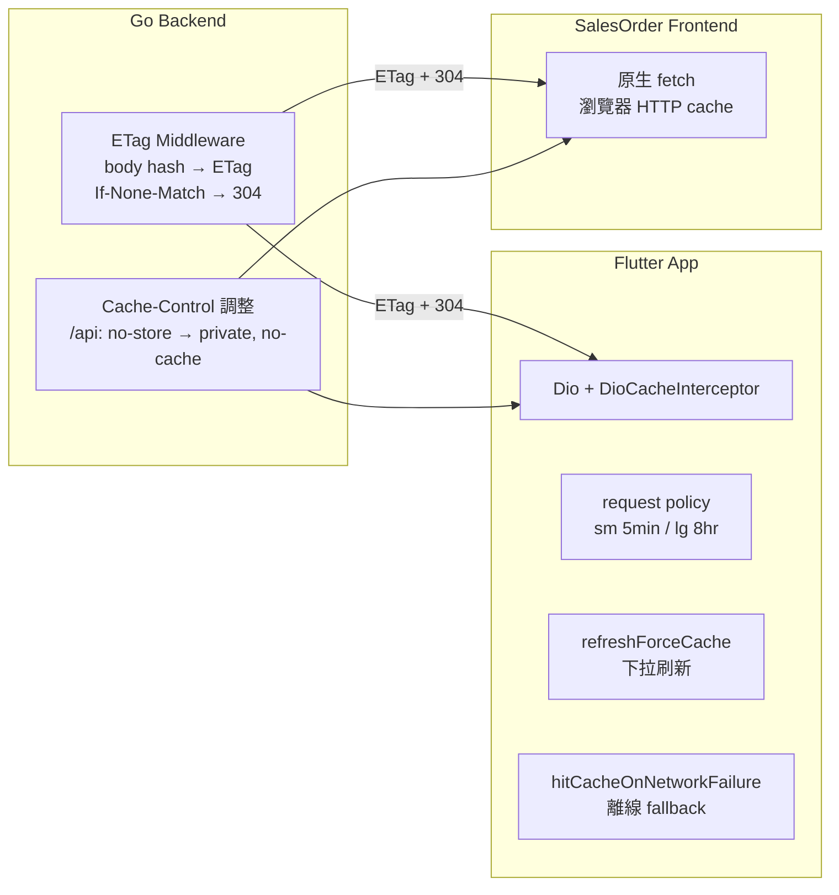

# dio cache 優化 — 設計規格

> 日期：2026-08-04  
> 狀態：設計核准  
> 關聯：sales-order-backend（Go）、sales-order-app（Flutter）

---

## 目標

讓 Flutter App 的 dio cache 真正運作：後端加 ETag 支援 HTTP revalidation，App 端修正 cache 配置（錯誤碼、斷網 fallback、死碼清理）。**Web frontend（sales-order-frontend）零改動、零行為影響。**

## 背景：根因分析

### 現況問題（原始碼驗證）

1. **後端對所有 `/api` 請求設 `Cache-Control: no-cache, no-store`**（`internal/middleware/publicCache.go:10`）。dio_cache_interceptor 看到 `no-store` 即判定不可快取（http_cache_core `cache_strategy.dart:150` `if (rqCacheCtrl.noStore || respCacheCtrl.noStore) return false;`）。
2. **`request` policy（smCache/mdCache/lgCache 全部使用）依賴 response 帶 ETag / Last-Modified / Expires / Cache-Control max-age 之一才會寫入**（`_hasCacheDirectives`，cache_strategy.dart:174-181）。後端完全不送這些 headers → **所有 GET cache 寫入被靜默跳過，cache 形同虛設**。
3. `hitCacheOnErrorCodes: [400, 404, 500]` — 400 是 client 參數錯誤，不該命中 cache（會回傳與使用者輸入無關的舊資料）。
4. `hitCacheOnNetworkFailure` 未啟用（預設 false）— 斷網時不嘗試 cache fallback，直接報錯。
5. `mdCache` (15min) 定義但無任何 API 使用 — 死碼。
6. `CacheByURL` middleware 與 `CacheURL` constant 已定義但未註冊/未使用 — dead code，不在本次範圍。

### 行為推論

- 進頁面 → 打 API → response 無 cache headers + `no-store` → 不寫入 cache → 每次都是真實網路請求。
- 下拉刷新（`refreshForceCache`）→ 強制寫入 → 之後短時間內 `request` policy 讀得到（entry 存在且未過 maxStale）。
- 斷網 → `hitCacheOnNetworkFailure=false` → 直接報錯，無離線資料。

---

## 設計

### 架構



### 核心機制

後端加 ETag middleware：所有 GET response 計算 body hash → `ETag: <hash>`；收到 `If-None-Match` 且相符回 304 空 body。兩端受益：

- **Flutter App（dio）**：`request` policy 之前因無 cache headers 永不寫入 → 有 ETag 後可寫入；過期後自動帶 `If-None-Match` revalidate，304 時用 cache body（省傳輸、省解析）。
- **Web frontend**：瀏覽器原生快取行為，304 完全透明，資料永遠最新（`no-cache` revalidate 語義），零改動。

**關鍵約束**：`Cache-Control` 從 `no-cache, no-store` 改為 `private, no-cache` — 保留 revalidate 語義、絕不 `public`（避免已登入用戶資料被共享快取串到其他用戶）。

---

## 後端變更

### 1. 新建 `internal/middleware/etag.go`

```go
package middleware

import (
	"bytes"
	"crypto/sha256"
	"encoding/hex"
	"net/http"
	"strings"
)

// ETagMiddleware 為 GET 回應計算 ETag，並處理 If-None-Match → 304。
// 只套用於 API GET 請求；非 GET 直接放行。
func ETagMiddleware(next http.Handler) http.Handler {
	return http.HandlerFunc(func(w http.ResponseWriter, r *http.Request) {
		if r.Method != http.MethodGet {
			next.ServeHTTP(w, r)
			return
		}

		// 包一層 ResponseWriter 緩衝 header + body，handler 結束後統一輸出，
		// 這樣才能先算 hash 再決定回 304 或完整 body。
		bw := &bodyBufferWriter{ResponseWriter: w}
		next.ServeHTTP(bw, r)

		// 非 200 或無 body：原樣輸出（不設 ETag，不判 304）
		if bw.statusCode != http.StatusOK || bw.body.Len() == 0 {
			bw.flush()
			return
		}

		hash := sha256.Sum256(bw.body.Bytes())
		etag := `"` + hex.EncodeToString(hash[:16]) + `"` // 128-bit 足夠

		// If-None-Match 相符 → 304 無 body
		if match := r.Header.Get("If-None-Match"); match != "" {
			if strings.Contains(match, etag) || match == "*" {
				bw.header.Set("ETag", etag)
				bw.WriteHeader(http.StatusNotModified)
				bw.flush()
				return
			}
		}

		bw.header.Set("ETag", etag)
		bw.flush()
	})
}

// bodyBufferWriter 緩衝 statusCode、headers、body，由 flush() 統一輸出到
// 底層 ResponseWriter。避免「先寫出再後悔」——ETag 需完整 body 才能計算。
type bodyBufferWriter struct {
	http.ResponseWriter
	header     http.Header
	body       bytes.Buffer
	statusCode int
	flushed    bool
}

func (b *bodyBufferWriter) Header() http.Header {
	if b.header == nil {
		b.header = http.Header{}
	}
	return b.header
}

func (b *bodyBufferWriter) WriteHeader(code int) {
	b.statusCode = code
}

func (b *bodyBufferWriter) Write(p []byte) (int, error) {
	return b.body.Write(p)
}

// flush 將緩衝內容實際寫入底層 ResponseWriter。
// 先複製 header（含 handler 設定的 Content-Type 等），再寫 status + body。
func (b *bodyBufferWriter) flush() {
	if b.flushed {
		return
	}
	b.flushed = true

	// 複製所有 header（ETag 等由 middleware 在 flush 前設定）
	for k, vv := range b.header {
		for _, v := range vv {
			b.ResponseWriter.Header().Add(k, v)
		}
	}

	code := b.statusCode
	if code == 0 {
		code = http.StatusOK
	}
	b.ResponseWriter.WriteHeader(code)
	if code != http.StatusNoContent && code != http.StatusNotModified {
		_, _ = b.ResponseWriter.Write(b.body.Bytes())
	}
}
```

### 2. 掛載於 `internal/server/server.go` `setGlobalMiddleware()`

在 `PublicCacheMiddleware` 之後加入：

```go
s.router.Use(middleware.ETagMiddleware)
```

### 3. 調整 `internal/middleware/publicCache.go`

```go
func PublicCacheMiddleware(next http.Handler) http.Handler {
	return http.HandlerFunc(func(w http.ResponseWriter, r *http.Request) {
		// API 路由：private, no-cache — 允許 client 存 cache 但每次 revalidate
		// （配合 ETag 做條件請求）。絕不 public，避免已登入用戶資料被共享。
		if strings.HasPrefix(r.URL.Path, "/api") {
			w.Header().Set("Cache-Control", "private, no-cache")
			next.ServeHTTP(w, r)
			return
		}
		w.Header().Set("Cache-Control", "public, max-age=300, s-maxage=600")
		next.ServeHTTP(w, r)
	})
}
```

### 後端設計決策

| 項目 | 決策 | 理由 |
|------|------|------|
| Hash 演算法 | SHA-256 取前 16 bytes | 128-bit 對緩存用途碰撞率足夠 |
| 只 GET | 非 GET 放行 | POST/PUT/PATCH 不該被緩存 |
| 只 200 且有 body | 非 200 或空 body 不設 ETag | 錯誤回應不緩存；304/204 無 body |
| 304 不寫 body | `flush()` 時 304 跳過 body | 標準 HTTP 語義，省傳輸 |
| body 緩衝 | `bodyBufferWriter` 緩衝 header+body，`flush()` 統一輸出 | 需先算 hash 才能設 ETag；同時避免「先寫出後悔」（非 200 也能正確輸出） |

---

## App 端變更

### `lib/layer_data/repositories/cache_storage.dart`

```dart
CacheOptions _buildCacheOptions({
  CachePolicy policy = CachePolicy.request,
  CachePriority priority = CachePriority.normal,
  Duration maxStale = const Duration(minutes: 5),
}) {
  return CacheOptions(
    store: _store,
    policy: policy,
    priority: priority,
    maxStale: maxStale,
    // 400 是 client 錯誤，不該命中 cache；保留 404/500 做錯誤 fallback
    hitCacheOnErrorCodes: [404, 500],
    // 斷網時嘗試從 cache 讀取（需 cache 已有 entry）
    hitCacheOnNetworkFailure: true,
    keyBuilder: CacheOptions.defaultCacheKeyBuilder,
  );
}
```

### 死碼清理

`mdCache` / `mediumCacheOptions` (15min) 若確認無使用則刪除（實作前 grep 全專案確認）。

### App 端不改的部分

- `RefreshableResource` — `refresh()` 用 `refreshForceCache`，行為正確。
- 各 API 的 `defaultCache`（smCache/lgCache 分類）— 維持現狀。
- `noCache`（auth/me/csrf）— 維持。

---

## 各端點 Cache 策略對照

| API | 資料特性 | 策略 | TTL | 理由 |
|-----|----------|------|-----|------|
| metadict | 字典資料，少變動 | `request` + ETag | 8hr | 下拉選單資料 |
| article | 商品文章，少變動 | `request` + ETag | 8hr | 首頁內容 |
| department | 部門清單，少變動 | `request` + ETag | 8hr | 部門下拉 |
| customer | 客戶資料，中頻變動 | `request` + ETag | 5min | 列表/詳情 |
| salesorder | 訂單，高頻變動 | `request` + ETag | 5min | 訂單列表 |
| estimate | 估價項目，中頻 | `request` + ETag | 5min | 估價下拉 |
| auth / me / csrf | 敏感，即時 | `noCache` | — | 登入狀態不緩存 |
| 下拉刷新 | — | `refreshForceCache` | — | 強制重抓 + 更新 ETag |

### 修復後行為

```
首次進頁面  → 網路請求 200 + ETag → 寫入 cache
5min 內再進 → cache 直接命中（零網路）
超過 5min   → 帶 If-None-Match revalidate
               ├─ 304 → 用 cache body（省傳輸）
               └─ 200 → 更新 cache + ETag
下拉刷新    → refreshForceCache 強制重抓 → 更新 cache + ETag
斷網        → hitCacheOnNetworkFailure → 顯示 cache 舊資料
伺服器 404/500 → hitCacheOnErrorCodes → 嘗試 cache fallback
```

---

## 測試

### 後端（Go）

`internal/middleware/etag_test.go`：
1. GET 200 回應帶 `ETag` header，值為 `"<hex>"` 格式
2. 相同 body 兩次請求 ETag 相同
3. 帶 `If-None-Match` 且相符 → 304 且無 body
4. 帶 `If-None-Match` 不相符 → 200 完整 body + ETag
5. 非 GET（POST）→ 不設 ETag，body 正常輸出
6. 非 200（404/500）→ 不設 ETag，**status code 與 body 正確輸出**（flush 回歸測試）
7. 空 body 200 → 不設 ETag
8. 304 時 body 為空（flush 跳過 body）

`internal/middleware/public_cache_test.go`（若有既有測試則擴充）：
1. `/api` 路徑 → `Cache-Control: private, no-cache`
2. 非 `/api` 路徑 → `public, max-age=300, s-maxage=600`（不變）

### App（Flutter）

- 既有測試維持通過（auth 相關測試不受影響 — auth 走 `noCache`）
- 新增 cache_storage 配置測試（若可行）：`hitCacheOnErrorCodes` 不含 400、`hitCacheOnNetworkFailure` 為 true
- 整合驗證（手動，非自動化）：起後端 + 跑 App，用 Talker logger 觀察請求數 — 第一次 200、5min 內第二次 0 請求、過期後 1 次 304

### Frontend（Web）

- 無程式碼變更；手動驗證跑一次頁面資料正常

---

## 範圍界定（YAGNI）

- ❌ 不做 service worker / 完整 PWA 離線
- ❌ 不改 frontend 任何程式碼
- ❌ 不做記憶體 cache 層（`CacheByURL` 既有 dead code，不動）
- ✅ 只動：後端 ETag middleware + Cache-Control 調整、App 端 cache_storage 配置

---

## 風險與緩解

| 風險 | 影響 | 緩解 |
|------|------|------|
| `private, no-cache` 改變 frontend 瀏覽器行為 | 低 — no-cache revalidate 語義與現況（每次 full 200）等價，304 更快 | 手動驗證 frontend 頁面 |
| body 緩衝記憶體 | GET 列表 body 多一份緩衝 | 目前 API 分頁規模可接受；若有大檔案下載需排除 |
| ETag hash 碰撞 | 極低 — SHA-256 前 16 bytes (128-bit) | 緩存用途碰撞率可忽略 |
| `hitCacheOnNetworkFailure` 顯示舊資料無提示 | 使用者可能困惑 | 可接受（離線模式）；後續可在 UI 加 stale 提示（非本次範圍） |
| 304 後 dio 用 cache body 但 service 重新 parse | 無影響 — 行為與 200 等價 | — |
