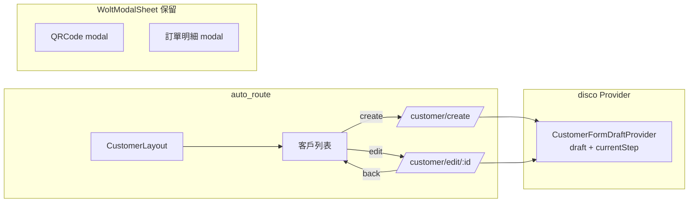

# auto_route 與 WoltModalSheet 整合 — 設計規格

> 日期：2026-08-04  
> 狀態：設計核准  
> 關聯：sales-order-app（Flutter 行動應用）

---

## 目標

統一導航心智模型：客戶 create/edit 表單從 WoltModalSheet modal 遷移至 auto_route 路由頁面，使表單狀態可被 401 還原、導航統一、可測試。訂單明細與 QRCode 檢視維持 modal（保留 WoltModalSheet 套件）。

## 決策摘要（brainstorm 確認）

| 決策 | 選擇 | 理由 |
|------|------|------|
| 整合動機 | 統一導航心智模型 | modal 是副導航系統，動態表單應走路由 |
| 範圍 | 客戶 create/edit → 路由；訂單明細、QRCode 維持 modal | 動態表單需狀態保存；純檢視維持輕量 |
| 路由結構 | `/customer/create`、`/customer/edit/:id` 兩路由 + 內部 stepper | 表單狀態集中，401 還原最簡單 |
| 表單狀態 | disco `CustomerFormDraftProvider` 持有草稿 + currentStep | 401 還原後草稿不丟 |
| WoltModalSheet | 保留套件；modal_service 的 create/edit 邏輯遷移至路由頁面 | 訂單明細/QRCode 仍用 |
| 實作路線 | 先建骨架再遷移（Provider → 路由 → stepper → 移除舊 modal → 清理）| 每步可測、風險低 |

---

## 架構



### 路由變更

`lib/layer_business/router/routes.dart` 的 customerLayout children 新增（需重新 `build_runner` 產生 `routes.gr.dart`）：

```dart
AutoRoute(
  path: rootSplash(customerLayout),
  page: CustomerLayoutRoute.page,
  guards: [AuthGuard()],
  children: [
    RedirectRoute(path: "", redirectTo: customer),
    AutoRoute(path: customer, page: CustomerRoute.page),
    // 新增：
    AutoRoute(path: customerCreate, page: CustomerCreateRoute.page),
    AutoRoute(path: '$customerEdit/:id', page: CustomerEditRoute.page),
  ],
),
```

`RoutePath`（`paths.dart`）新增 `customerCreate`、`customerEdit` 兩值。

### 新增檔案

```
lib/layer_business/services/customer/customer_form_draft_provider.dart   # 草稿 Provider
lib/layer_presentation/stories/admin/customer/customer_create_screen.dart  # @RoutePage
lib/layer_presentation/stories/admin/customer/customer_edit_screen.dart    # @RoutePage
lib/layer_presentation/stories/admin/customer/widgets/customer_form_stepper.dart  # 共用 stepper
```

---

## 表單狀態：CustomerFormDraftProvider

```dart
// lib/layer_business/services/customer/customer_form_draft_provider.dart
final customerFormDraftProvider = Provider(
  (context) => CustomerFormDraftProvider(),
  dispose: (p) => p.dispose(),
);

class CustomerFormDraftProvider {
  final _draft = Signal<CustomerModel?>(null);
  final _currentStep = Signal<int>(0);
  final _editingCustomerId = Signal<int?>(null);

  CustomerModel? get draft => _draft.value;
  int get currentStep => _currentStep.value;
  int? get editingCustomerId => _editingCustomerId.value;

  Signal<CustomerModel?> get draftSignal => _draft;
  Signal<int> get currentStepSignal => _currentStep;
  Signal<int?> get editingCustomerIdSignal => _editingCustomerId;

  /// 開啟 create 流程：清空草稿，步驟歸零。
  void startCreate() {
    _draft.value = null;
    _currentStep.value = 0;
    _editingCustomerId.value = null;
  }

  /// 開啟 edit 流程：記錄目標 id；若無殘留草稿則待頁面載入填入。
  void startEdit(int customerId) {
    _editingCustomerId.value = customerId;
    _currentStep.value = 0;
  }

  /// 草稿優先：401 還原時若已有同 id 草稿則沿用。
  void setDraft(CustomerModel draft, {int? step}) {
    _draft.value = draft;
    if (step != null) _currentStep.value = step;
  }

  void setStep(int step) => _currentStep.value = step;

  /// 提交成功或取消時清除。
  void clearDraft() {
    _draft.value = null;
    _currentStep.value = 0;
    _editingCustomerId.value = null;
  }

  void dispose() {
    _draft.dispose();
    _currentStep.dispose();
    _editingCustomerId.dispose();
  }
}
```

### 草稿 vs 重新載入（edit 頁面）

EditScreen init 流程：
1. `editingCustomerId` 已設為目標 id
2. 若 Provider 已有草稿且 `editingCustomerId` 相符 → 直接用草稿（401 殘留），並恢復 `currentStep`（`setStep`）
3. 否則依 id 呼叫 `customerApi.get(id)` 載入 → `setDraft(customer)`

---

## 遷移策略（方案 A — 先建骨架再搬遷）

| 步驟 | 內容 | 產出 |
|------|------|------|
| 1 | 建 `CustomerFormDraftProvider` + 註冊（customerLayout 的 ProviderScope）| 草稿容器 |
| 2 | 建 `/customer/create`、`/customer/edit/:id` 路由 + `CustomerCreateScreen`/`CustomerEditScreen` 骨架（stepper 空殼）| 可導航的路由 |
| 3 | 搬 `_mainContent` 表單內容 → stepper 步驟 1（主要資料）| 步驟 1 可用 |
| 4 | 搬 `_addressContent` → 步驟 2；`_contactsContent` → 步驟 3 | 全部步驟可用 |
| 5 | 移除 `modal_service.dart` 的 `modalCreateShow`/`modalEditShow`（保留 `modalQRCodeShow`）；更新呼叫點改 `pushPath` | 舊 modal 移除 |
| 6 | 清理：`modal_service.dart` 縮小到只剩 QRCode 邏輯；`routes.gr.dart` 重新生成 | 乾淨 |

---

## Stepper（customer_form_stepper.dart）

共用 create/edit 的步驟容器。步驟對應 modal 的頁面：

| 步驟 | 內容 | 來源（modal_service）|
|------|------|------|
| 1 | 主要資料 | `_mainContent` → `main_form.dart` / `main_edit_form.dart` |
| 2 | 地址 | `_addressContent` → `address_form.dart` / `address_edit_form.dart` |
| 3 | 聯絡人 | `_contactsContent` → `contact_form.dart` / `contact_edit_form.dart` |

```dart
class CustomerFormStepper extends StatefulWidget {
  const CustomerFormStepper({
    super.key,
    required this.formModel,     // CustomerModelForm（reactive_forms）
    required this.onSubmit,      // 提交回呼（create/edit 各自）
    required this.submitLabel,   // '新增客戶' / '修改客戶'
  });
}
```

**步驟切換**：
- 前進：驗證目前步驟欄位 → 寫回草稿 → `draftProvider.setStep(step+1)`
- 後退：`draftProvider.setStep(step-1)`（不驗證）
- 提交（最後一步）：`onSubmit(formModel.rawModel)` → 成功 `clearDraft()` + `router.pop()`

**表單值同步**：表單值變更即寫回草稿（`formModel.rawModel`），草稿永遠最新，401 還原時直接可用。

**視覺**：標準 Material Stepper 或自訂步驟指示器（沿用現有 `expansion_tile_group` / `tab_container` 風格，實作時依現有元件決定）。

---

## 呼叫點變更

| 現況 | 改為 |
|------|------|
| `customer_layout_screen.dart:39` `modalCreateShow(customerCreateButton)` | `context.router.push(CustomerCreateRoute())` |
| `customer_list.dart:89` `modalEditShow(customer, customerEditButton)` | `context.router.push(CustomerEditRoute(id: customer.id))` |
| `profile_list.dart:34` `modalEditShow(cm, customerEditButton)` | `context.router.push(CustomerEditRoute(id: cm.id))` |

**按鈕**（`customer_button.dart`）：`customerCreateButton`/`customerEditButton` 保留（stepper 提交區用），`maybePop()` 行為維持（push 頁面 pop 正確）。

**modal_service.dart**：移除 `modalCreateShow`/`modalEditShow`（及 `_createPageList`/`_editPageList`/`_mainContent`/`_addressContent`/`_contactsContent`），保留 `modalQRCodeShow` + `_qrcodeContent` + `_closeSet` + `_checkValid`（QRCode modal 用）。

---

## 錯誤處理

| 情境 | 處理 |
|------|------|
| 載入客戶失敗（edit）| 顯示錯誤 + 重試（沿用 `reloadRefreshButton` 模式），草稿不清 |
| 提交失敗 | `alertable_mixin`/`ErrorException` 顯示錯誤，**草稿不清除**，可重試 |
| 401 提交時 | 既有 AuthInterceptor 處理；草稿在 Provider 層級保留 |
| metadict 載入失敗（stepper dropdown）| 沿用 SignalBuilder error/loading 分支 |

---

## 測試

| 層級 | 內容 |
|------|------|
| Unit | `CustomerFormDraftProvider`：startCreate/startEdit/setDraft/setStep/clearDraft/草稿優先邏輯 |
| Widget | stepper 步驟切換（驗證 → 前進/後退 → currentStep 更新）|
| Widget | create 提交呼叫 `createCustomer` → `clearDraft` + pop |
| Widget | edit 載入 id → 草稿填入；401 殘留草稿優先於重新載入 |
| 回歸 | 既有測試全過（auth/modal 相關不受影響）|

---

## 範圍界定（YAGNI）

- ❌ 訂單明細 modal（維持）
- ❌ QRCode modal（維持）
- ❌ `wolt_modal_sheet` 套件（保留）
- ❌ 其他對話框（alertable_mixin、AwesomeDialog、session overlay）
- ❌ 外部 deep link 設定（表單不需外部 URL；路由本身可達，AuthGuard 保護）
- ✅ 只動：客戶 create/edit 表單遷移 + CustomerFormDraftProvider + stepper

---

## 風險與緩解

| 風險 | 影響 | 緩解 |
|------|------|------|
| 表單遷移引入驗證/提交行為差異 | 客戶編輯壞掉 | 逐步搬遷（每步測試）；stepper 沿用既有表單 widget |
| 草稿同步遺漏（表單值沒寫回）| 401 還原拿到舊草稿 | 表單值變更即寫回草稿 |
| 草稿殘留（未清除）| 下次 create 出現舊資料 | startCreate 清空；提交/取消 clearDraft |
| edit 頁面載入與草稿衝突 | 覆寫使用者編輯中內容 | 草稿優先（同 id）；僅無草稿時重新載入 |
| stepper 與 modal 視覺差異 | UX 改變 | 沿用現有表單 widget 與色彩系統；stepper 指示器實作時確認 |
